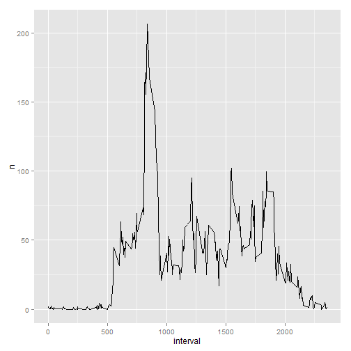

This is the output required by the first Peer Assessment.  The flow of the headings will follow the questions that were asked in the assignment for the ease of the reader.  

##Loading and Preprocessing the Data
This reads the data in and converts the values appropriately

```r
setwd("~/Rworkingdir/ReprodResearch")
#unzip the file
unzip("repdata-data-activity.zip")
#read.csv
active<- read.csv("activity.csv",header=TRUE,stringsAsFactors = FALSE)
active$date<- as.Date(active$date,"%Y-%m-%d")
active$steps<-as.numeric(active$steps)
```

##The Mean and Median Steps Per Day
This is interpretted as requesting one number overall rather than by day.

```r
#what is the mean number of steps taken per day
library(dplyr)
active2 <- group_by(active,date)
active2<- summarise(active2,n=sum(steps,na.rm = TRUE))
hist(active2$n)
```

 

```r
mean(active2$n)
```

```
## [1] 9354.23
```

```r
median(active2$n)
```

```
## [1] 10395
```

##*What is the Daily Average Pattern?*

```r
active3<- group_by(active,interval)
active3<- summarise(active3, n=mean(steps,na.rm=TRUE))

library(ggplot2)
g<-ggplot(active3,aes(x=interval,y=n))
g+geom_line()
```

 

```r
subset(active3,active3$n>200)
```

```
## Source: local data frame [1 x 2]
## 
##   interval        n
##      (int)    (dbl)
## 1      835 206.1698
```

##**Imputting Missing Values**
### Number of missing values

```r
#Calculate the number of NA's
sum(!complete.cases(active))
```

```
## [1] 2304
```

To overcome the NA's in the data, I have chosen to use the mean for that particular day in place of the NA.
First this requires the average to be calculated.
Then review of that data shows that some days are entirely NA.
Therefore the for loop has a nested loop that looks to see if the average is NA and returns a zero in the case that it is.

The final step of this piece of code is to create a matching dataset to the original but with the imputted data in it.

```r
#Create a strategy for replacing na's

#Replace na's with mean for that day
#Use summarised data and merge based on date
#Create if that says if na then take mean value - in for loop
active4<-group_by(active,date)
active4<-summarise(active4,n=mean(steps,na.rm = TRUE))

active5<- merge(active,active4, all.x = TRUE)

#Create mean replacement values if NA
active5$imputsteps<-0
# for loop of every row
#create an if statement that if steps =na, if mean=nan = 0, else mean, else steps
for (i in 1:nrow(active5)) {
    if(is.na(active5$steps[i])) {
            if(is.na(active5$n[i])){
                    active5$imputsteps[i]<-0
            }
            else(active5$imputsteps[i]<- active5$n[i])
    }
        else(active5$imputsteps[i]<-active5$steps[i])
}

#create output that is the same as the original but with imputed data
active6<- select(active5,steps=imputsteps,date,interval)
```

###Create a Histogram and KPI's of the Imputted Data
The following code creates a histogram of the imputted data and also creates a comparison of the mean and median.
The first value is the mean or median from new imputted dataset.  The second value is the difference to the original value.

```r
active7<-group_by(active6,date)
active7<- summarise(active7,TotalDays=sum(steps))
#Show the mean and the median of the values
c(mean(active7$TotalDays),mean(active7$TotalDays)-mean(active2$n))
```

```
## [1] 9354.23    0.00
```

```r
c(median(active7$TotalDays),median(active7$TotalDays)-median(active2$n))
```

```
## [1] 10395     0
```

```r
#No variance in answer because they are summarised and the values used to replace
#have reenforced these values.
#However if you were to look at by day rather than group then values would be different

hist(active7$TotalDays)
```

 

There is no variance in the answers because they are based on summarised statistics.  Therefore even though n has increased in the base data, this hasn't impacted the summarised statistic.
If the calculations were to take place on each day then these would likely have changed.

##*Are there differences in Weekends and Weekday Activities*
This code creates a seperate dataframe which identifies the weekday to weekend or weekday, and then merges it with the imputted data set.

```r
#Are there variances in weekday or weekend activities
Ref<- data.frame(Day=c("Monday","Tuesday","Wednesday","Thursday","Friday","Saturday","Sunday"),
                 Type=c("Weekday","Weekday","Weekday","Weekday","Weekday","Weekend","Weekend"))
active6$Day<-weekdays(active6$date)
active8<-merge(active6,Ref,all.x = TRUE)
active9<-group_by(active8,interval, Type)
active9<-summarise(active9,MeanSteps=mean(steps))
g<- ggplot(active9, aes(x=interval,y=MeanSteps))
g+geom_line()+facet_grid(Type~.)
```

 

